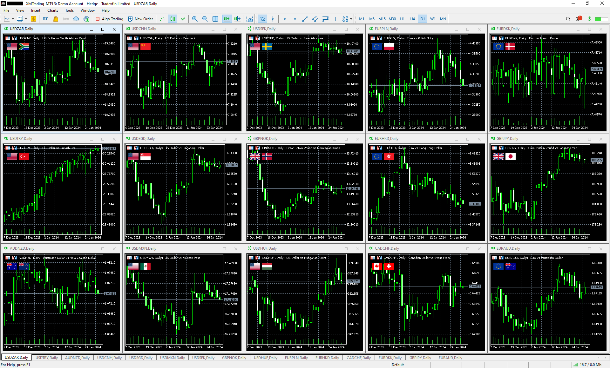

# CountryFlags
## 概要
取引中の通貨ペアの国旗をMT5ターミナル画面に表示するインジケータです。

## 使用方法
1. ReleasesからCountryFlags.zipをダウンロードします。
1. zipファイルの内容をMT5のデータフォルダにコピーします。  
    ※ デフォルトのデータフォルダは以下：
    C:\Users\（ユーザー名）\AppData\Roaming\MetaQuotes\Terminal\（インスタンスID）
1. MT5を起動します。
1. NavigatorウィンドウのIndicatorsツリーからCountryFlagsをチャートに貼り付けます。  

## 必要なもの
- 本ツールの利用にはMT5が必要です。各証券会社がHPで配布しています。本ツールはどの証券会社のMT5でも動作します。

## 補足
- MT4では動作しません。コンパイルも通りません。
- ワンクリックトレード画面の表示/非表示に対応して表示位置が変わります。
